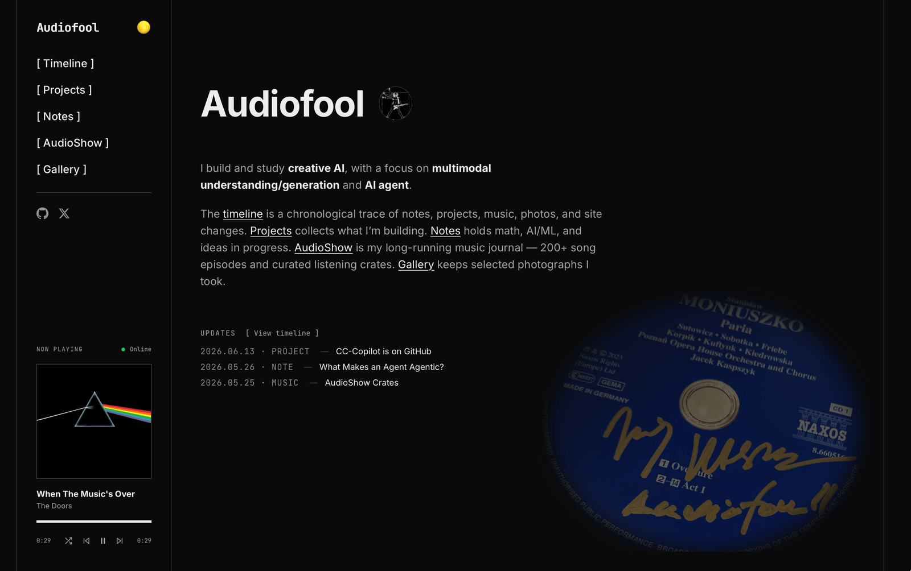

# audiofool.blog

A personal archive for notes, music, photography, projects, and public traces of ongoing work.

<p align="center">
  <a href="https://audiofool.blog">
    
  </a>
</p>

The site is built with Astro and maintained as a set of small, typed content systems. GitHub is the source of code and project documentation; the website is the public layer that gives those materials a consistent visual language.

🌐 **Live:** [audiofool.blog](https://audiofool.blog)
📡 **Feed:** [/rss.xml](https://audiofool.blog/rss.xml) — projects, notes, photography, AudioShow, and timeline in one stream

---

## Sections

| Section | Role |
| --- | --- |
| **Notes** | Personal essays, technical ideas, models, methods, and references |
| **AudioShow** | A curated listening archive with playable legal previews |
| **Gallery** | Selected photographs with camera, lens, and film metadata |
| **Projects** | Project dossiers backed by GitHub metadata and README snapshots |
| **Timeline** | A curated chronological record of public site activity |

---

## Design System

The site uses a restrained black-and-white archival style:

- thin line borders,
- compact monospace metadata,
- bracketed filters,
- quiet hover states,
- typography-first layouts,
- no third-party visual embeds.

External services can provide data, but the site owns the presentation.

---

## GitHub-backed Projects

Project pages can link to a GitHub repository and render a committed README snapshot.

```yaml
---
title: "Project Name"
pubDate: 2026-01-01
description: "Short public description."
category: "Research"
status: "active"
stack: ["Astro", "Agents", "Music"]
type: "Experiment"
githubRepo: "Audiofool934/example-repo"
githubReadme: true
---
```

Run `npm run refresh:github-projects` to fetch repository metadata and README content, sanitize third-party README HTML, and update the committed snapshot. `npm run build` uses that snapshot, so deploys do not depend on the GitHub API being reachable at build time.

The GitHub README can serve as the public project document. The website turns it into a designed project page.

---

## Development

```bash
npm install
npm run dev
npm run build
npm run preview
```

Useful scripts:

```bash
npm run sync:github-projects
npm run refresh:github-projects
```

---

## Project Structure

```text
src/
├── content/
│   ├── projects/            # Human-edited project metadata and briefs
│   ├── project-readmes/     # Committed GitHub README snapshot
│   ├── wiki/                # Notes content collection
│   ├── log/                 # Timeline entries
│   ├── audioshow/           # AudioShow markdown archive
│   └── gallery/             # Gallery metadata
├── data/
│   └── github-projects.json # Committed GitHub metadata snapshot
├── pages/
│   ├── projects/
│   ├── notes/
│   ├── timeline/
│   ├── audioshow/
│   └── gallery/
└── style/
    ├── global.css
    └── post.css
```

---

## License

This project is open source and was originally created by **Audiofool**. The canonical repository is
[github.com/Audiofool934/Audiofool934.github.io](https://github.com/Audiofool934/Audiofool934.github.io).

- **Source code** — the Astro site, components, scripts, and styles — is released under the [MIT License](LICENSE). Fork it, learn from it, and reuse it; attribution back to the original is appreciated.
- **Site content** — writing, photographs, AudioShow curation, and other personal media — is © Audiofool, all rights reserved, and is **not** covered by the MIT license.

If you build something on top of this, a link back to the original is welcome.
