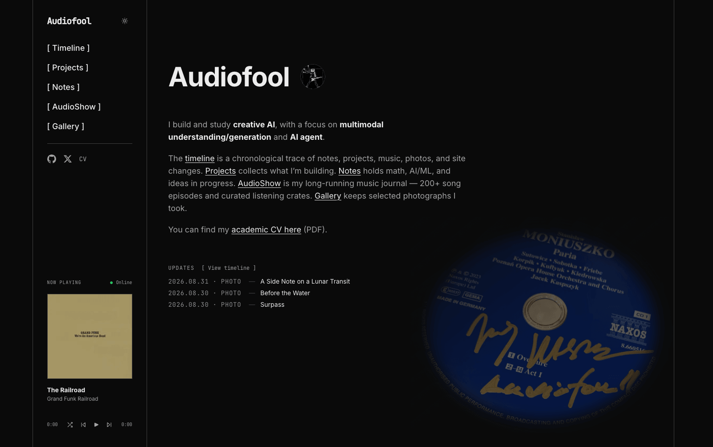

# audiofool.blog

A personal archive for notes, music, photography, and projects.

<p align="center">
  <a href="https://audiofool.blog">
    
  </a>
</p>

<p align="center">
  <a href="https://audiofool.blog"><strong>audiofool.blog</strong></a>
  ·
  <a href="https://audiofool.blog/rss.xml">RSS</a>
  ·
  <a href="https://audiofool.blog/timeline/">Timeline</a>
</p>

The site is a small set of typed content systems built with Astro.
GitHub holds the source and project documentation; the website gives all of it one visual language: monochrome, archival, and typography-first.
External services supply data, and the site owns the presentation.

## Sections

| Section | Route | What lives there |
| --- | --- | --- |
| Timeline | `/timeline/` | A curated record of updates across the site, also published as RSS |
| Projects | `/projects/` | Project dossiers backed by GitHub metadata and README snapshots |
| Notes | `/notes/` | Essays, methods, models, and references, with KaTeX math |
| AudioShow | `/audioshow/` | A long-running music journal with episode archive, curated crates, and a persistent player |
| Gallery | `/gallery/` | Selected photographs with subject filters and camera, lens, and film metadata |

## Stack

[Astro 6](https://astro.build) with content collections and client-side routing, TypeScript, Tailwind CSS 3, KaTeX, and Prism.
Fonts are self-hosted, image variants are generated at build time with `sharp`, and the site deploys to GitHub Pages.

## Getting started

Requires Node.js 22.12 or newer.

```bash
npm ci
npm run dev        # http://localhost:4321
```

| Command | Purpose |
| --- | --- |
| `npm run dev` | Generate image variants and start the dev server |
| `npm run build` | Generate image variants, clear Astro caches, and build to `dist/` |
| `npm run preview` | Serve the production build |
| `npm run check` | Strict Astro/TypeScript diagnostics, parser checks, and unit regressions |
| `npm run astro -- check` | Astro and TypeScript diagnostics |
| `npm run check:audioshow-parser` | AudioShow parser fixtures |
| `npm run check:unit` | Queue, provider, artwork, and filesystem route regressions |
| `npm run check:routes` | Built redirects, canonical destinations, and sitemap consistency |
| `npm run check:browser` | Production browser interactions; run after a build |
| `npm run check:performance` | Gzip size budgets and local math assets; run after a build |
| `npm run refresh:github-projects` | Fetch fresh GitHub metadata and README snapshots |
| `npm run build:with-sync` | Refresh GitHub snapshots, then build |
| `npm run gallery:intake` | Local photo curation desk (see [its README](scripts/gallery-intake/README.md)) |

## How it works

**Content.**
Each section is an Astro content collection of Markdown files under `src/content/`, validated by Zod schemas in `src/content.config.ts`.
Notes live in `wiki/` and timeline entries in `log/`; older `/wiki/` and `/log/` URLs redirect to their current routes.

**Updates.**
`src/utils/timelineItems.ts` decides what counts as an update.
The homepage, the Timeline, and the RSS feed all read from it.

**Projects.**
A project entry can point at a GitHub repository:

```yaml
githubRepo: "Audiofool934/example-repo"
githubReadme: true
```

`npm run refresh:github-projects` fetches repository metadata and the README, sanitizes it, and writes a snapshot to `src/data/github-projects.json` and `src/content/project-readmes/`.
The snapshot is committed, so builds never call the GitHub API.

**AudioShow.**
Episodes are authored in batches in `src/content/audioshow/` and parsed by `src/utils/parseAudioshow.ts`.
The player keeps playing across page navigation and supports Apple Music previews and direct audio URLs.
`src/scripts/audioPlayer.ts` coordinates typed modules in `src/scripts/audio/` for providers, queues, artwork, and UI bindings.
Episode artwork uses `data-audio-url`; Markdown contains content and playback data, while `audio/batch.ts` owns click and keyboard behavior.
Each crate lives in `src/data/audioshow-crates/`, with shared types and a small registry in `src/data/audioshowCrates.ts`.

**Images.**
`predev` and `prebuild` generate responsive variants of site images (AVIF with WebP fallback) and AudioShow artwork (WebP).
Gallery photographs are processed by Astro's image pipeline from `src/assets/gallery/`.
`src/utils/audioImages.mjs` defines AudioShow variant widths and paths for both the generator and Markdown transformation.
The gallery page prepares content and thumbnails; `src/components/gallery/` owns the filtering toolbar and photo viewer.

**Legacy routes.**
`src/data/legacyRedirects.mjs` records historical aliases.
Case-sensitive builds emit case-only redirects; case-insensitive builds omit those stubs because writing them would overwrite their canonical pages.
The production-output check verifies that canonical content survives and all emitted redirects reach existing destinations without loops.

## Project layout

```text
src/
├── components/   site shell, theme toggle, audio player, gallery toolbar and viewer
├── content/      Markdown collections: projects, project-readmes, wiki, log, audioshow, gallery
├── data/         GitHub snapshot, gallery subjects, crate registry and per-crate files
├── layouts/      the shared page shell
├── pages/        routes, legacy redirects, RSS, AudioShow playlist
├── scripts/      client code for the player and gallery
├── style/        theme tokens, prose typography, code highlighting
└── utils/        timeline, AudioShow parsing, date formatting
scripts/          image generation, GitHub sync, checks, gallery intake desk
tests/            focused unit regressions
public/           fonts, static media, CV
```

Conventions for contributors and coding agents are in [AGENTS.md](AGENTS.md).

## Deployment and performance

Pull requests and pushes to `main` run the same validation pipeline in [GitHub Actions](.github/workflows/deploy.yml).
It checks types, authored episodes, unit regressions, production routes, gzip budgets, and browser interactions before uploading the site.
Only successful runs on `main` outside pull requests can deploy to GitHub Pages.
The performance check enforces page and JavaScript budgets in `scripts/check-performance.mjs`.
Math pages load KaTeX locally, and only where it is needed.

Run the full checks locally with:

```bash
npm run check
npm run build
npm run check:routes
npm run check:performance
npx playwright install chromium     # One-time browser setup
npm run check:browser
```

The browser check starts and stops its own local production preview and Chromium instance.
It tests playback across navigation, pending provider requests, queue controls, gallery filters and keyboard behavior, theme persistence, and mobile overflow.
Provider responses and silent audio are fixtures, so the checks do not depend on Apple Music or preview-host uptime.
Screenshots and failure captures stay under ignored `.local/browser-check/`.

To audit a page against a running preview, compare the median of at least three runs:

```bash
npx lighthouse@13.4.1 http://localhost:4321/notes/policy-gradient/ \
  --only-categories=performance --chrome-flags=--headless
```

## License

The canonical repository is [Audiofool934/Audiofool934.github.io](https://github.com/Audiofool934/Audiofool934.github.io).

- **Code** (the Astro site, components, scripts, and styles) is released under the [MIT License](LICENSE).
- **Content** (writing, photographs, AudioShow curation, and other personal media) is © Audiofool, all rights reserved, and is not covered by the MIT License.

If you build on this, a link back is appreciated.
