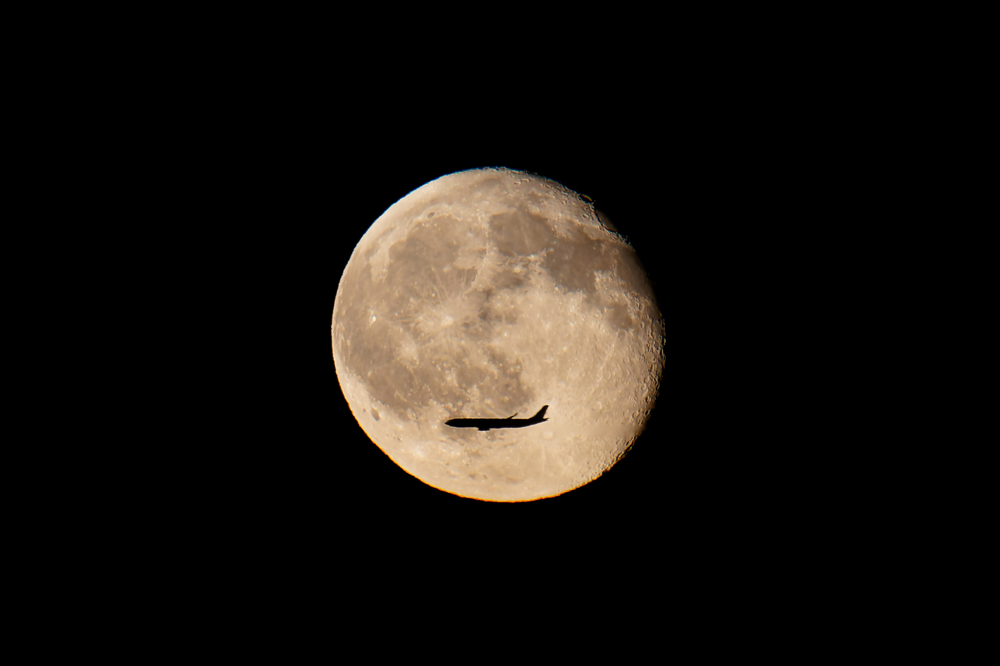

At 19:59:58 on August 30, 2026, a passenger jet crossed the Moon in my 400 mm frame.

Eight minutes and 27 seconds earlier, another aircraft had crossed the same rising Moon in a 241 mm cityscape.

The finished pair is in [Surpass](/gallery/lunar-transit/).

Two hits make a good story.
They do not, by themselves, give a probability.

## What the files tell me

The EXIF data gives two observations from Nanyuan Forest Wetland Park in southern Beijing.

| Frame | Local time | Focal length | Exposure | ISO |
| --- | --- | ---: | ---: | ---: |
| City | 19:51:30.911 | 241 mm | 1/30 s at f/6.3 | 1600 |
| Close | 19:59:58.364 | 400 mm | 1/80 s at f/6.3 | 400 |

I queried [JPL Horizons](https://ssd.jpl.nasa.gov/horizons/manual.html) for the approximate camera position.
At the close exposure, the Moon's airless apparent elevation was $3.3366^\circ$ and its angular diameter was $1876.915$ arcseconds, or $0.5214^\circ$.

An earlier back-of-the-envelope estimate put the elevation at $4.2^\circ$.
That was too high.
This correction matters because it lowers the reconstructed vertical component of the aircraft's position by roughly 200 m.

## Turning pixels into distance

In the close frame, the Moon measures about 930 px across and the silhouette about 280 px long.
The aircraft therefore spans about 30.1 percent of the Moon's apparent diameter:

$$
\theta_p = \frac{280}{930} \times 0.5214^\circ \approx 0.1570^\circ.
$$

The silhouette is not detailed enough for a responsible aircraft identification.
As a scale reference, an [Airbus A320](https://www.aircraft.airbus.com/en/aircraft/a320-family/a320ceo) is 37.57 m long, while a [Boeing 737-800](https://www.boeing.com/commercial/737ng) is about 39.5 m long.

Using 39.5 m as a representative projected length gives

$$
D = \frac{L}{2\tan(\theta_p/2)} \approx 14.4\ \text{km}.
$$

The main uncertainty is foreshortening.
Allowing a 36 to 45 m airframe and a projected-length factor of 0.85 to 1.0 gives a broad slant-range band of roughly 11 to 17 km.
This is a scale estimate, not a flight identification.

At the 14.4 km representative range, the Moon's angular disk projects to a circle about 131 m wide.
The aircraft was therefore crossing a moving 131 m line-of-sight target.
At an elevation of $3.3366^\circ$, the aircraft's line of sight was about 840 m above the camera's local horizontal plane.
That is not a terrain-corrected altitude above sea level.

## The visible crossing lasted about a second

The silhouette center sits about half a lunar radius below the Moon's center, so its path follows a chord about 114 m long at the aircraft's distance.
Subtracting a representative 39.5 m aircraft length leaves about 74 m during which the entire aircraft can remain inside the lunar disk.

At a projected speed of 65 to 90 m/s, full containment lasts approximately 0.82 to 1.14 s.
Counting any partial overlap expands that interval to roughly 1.7 to 2.4 s.

At 80 m/s, the aircraft travels about 1 m during a 1/80 s exposure.
At this image scale, that is about 7 px of travel.
A 1/500 s shutter would reduce the same motion to about 1.1 px.
The [Sony a7R V](https://www.sony.com/electronics/support/e-mount-body-ilce-7-series/ilce-7rm5/specifications) can shoot up to 10 frames per second, so a well-timed burst can sample the full-containment interval several times.

## A probability needs a denominator

There is no honest universal answer to "what were the odds?"
The chance for an arbitrary person looking at an arbitrary moonrise is much lower than the chance for a photographer who has selected a moonrise, a position, and a plausible flight corridor.

I model the latter: one planned opportunity near a candidate route.

Between the two exposures, Horizons gives a lunar sky motion of about $0.00423$ rad/min.
At the representative aircraft distance, that line of sight sweeps about 61 m/min across the aircraft's plane.
After allowing for a roughly 12.5 m aircraft height, the aircraft center has a full-containment tolerance of approximately $a=59$ m on either side of the lunar center.
The corresponding effective alignment window is about 1.95 min.

Let an aircraft's cross-track miss distance be normally distributed as

$$
X \sim \mathcal{N}(d,\sigma^2),
$$

where $d$ is the predicted route offset and $\sigma$ represents route and prediction uncertainty.
Then the chance that a candidate aircraft enters the full-containment corridor is

$$
p_{\text{track}} = \Phi\left(\frac{a-d}{\sigma}\right) - \Phi\left(\frac{-a-d}{\sigma}\right).
$$

If aircraft arrivals are approximated as a Poisson process with mean headway $H$, and $c$ is the probability that I am framed, focused, and shooting at the right moment, the expected number of captured transits is

$$
\Lambda = \frac{T}{H}p_{\text{track}}c,
$$

and

$$
P(\text{at least one}) = 1-e^{-\Lambda}.
$$

The inputs below are illustrative planning assumptions, not measured traffic statistics for that evening.

- **Conservative:** $H=6$ min, $d=150$ m, $\sigma=300$ m, and $c=60\%$ give $p_{\text{track}}=13.9\%$ and a **2.7%** chance of at least one captured transit.
- **Central:** $H=4$ min, $d=100$ m, $\sigma=200$ m, and $c=75\%$ give $p_{\text{track}}=20.7\%$ and a **7.3%** chance of at least one captured transit.
- **Well-aligned and busy:** $H=2$ min, $d=0$ m, $\sigma=100$ m, and $c=90\%$ give $p_{\text{track}}=44.7\%$ and a **32.4%** chance of at least one captured transit.

Under those assumptions, one planned opportunity lands in a conditional range of roughly 3 to 32 percent, with a central example near 7 percent.
That is approximately one success in 14 comparable planned attempts, but only under the central model.
It is not a universal "one in 14" claim.

## What the second frame changes

Two transits separated by more than eight minutes do not fit a single fixed-distance route window cleanly.
They could represent different corridors, different distances or altitudes, or route geometry that the simple model does not capture.

I also checked public historical ADS-B playback for the time and area.
Coverage was too sparse to identify either aircraft or reconstruct a complete traffic rate, so I did not use it to manufacture a more precise probability.

The second frame is evidence that the evening offered more than one effective opportunity.
It is not enough to infer the unconditional odds of the event.

## My verdict

The geometric reconstruction is reasonably constrained: the close aircraft was probably around 11 to 17 km away, with 14.4 km as a useful representative value, and it occupied the lunar disk for roughly one to two seconds.

The probability is necessarily conditional.
For a selected moonrise near a plausible corridor, my transparent toy model gives about 3 to 32 percent per planned opportunity.
For an unplanned moonrise from an arbitrary location, the probability is lower and cannot be estimated from these two photographs alone.

The practical lesson is more useful than a dramatic rarity claim.
With a lunar ephemeris, historical flight tracks, a deliberate shooting position, a faster shutter, and a burst started before contact, this becomes a schedulable hunt rather than pure luck.

The complete arithmetic is in [`scripts/calculate-lunar-transit.mjs`](https://github.com/Audiofool934/Audiofool934.github.io/blob/main/scripts/calculate-lunar-transit.mjs).
The script stores the measured pixels, Horizons outputs, assumptions, and all three probability scenarios so the result can be challenged or recomputed.

### Sources

- [JPL Horizons manual](https://ssd.jpl.nasa.gov/horizons/manual.html)
- [JPL Solar System Dynamics physical parameters](https://ssd.jpl.nasa.gov/sats/phys_par/sep.html)
- [NASA Moon facts](https://science.nasa.gov/moon/facts/)
- [Airbus A320ceo dimensions](https://www.aircraft.airbus.com/en/aircraft/a320-family/a320ceo)
- [Boeing 737 Next Generation dimensions](https://www.boeing.com/commercial/737ng)
- [Sony a7R V specifications](https://www.sony.com/electronics/support/e-mount-body-ilce-7-series/ilce-7rm5/specifications)
