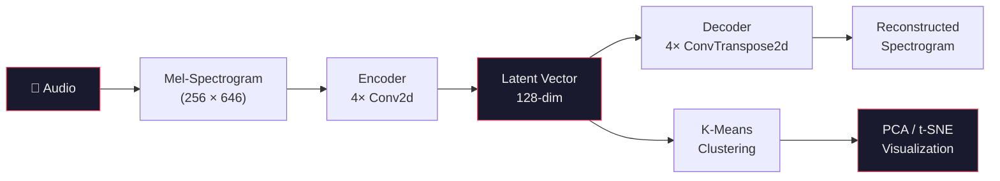

# Data Side of the Moon

<p>
  
</p>

<p>
  <em>Can a neural network learn to "hear" music — without ever being told what genre it is?</em>
</p>

***

Genre labels are a human invention. They're useful, but they're also reductive — Pink Floyd doesn't fit neatly into "rock," and neither does most interesting music. Supervised classification is bounded by the labels we give it.

This project takes a different approach: train a convolutional autoencoder on raw mel-spectrograms with **no labels at all**, then see what structure the model discovers on its own. The autoencoder — named **Echoes** — compresses 15-second audio segments into 128-dimensional latent vectors, learning a representation of "what music sounds like" purely from reconstruction.

When we project Pink Floyd's entire discography into this learned space and cluster it, something interesting emerges: the clusters track the band's stylistic evolution across decades — without the model knowing anything about albums, years, or genres.

## How It Works



**1. Preprocessing** — Raw audio is converted to normalized log-mel spectrograms (256 mel bins, 2048-point FFT, hop length 512). Each song is split into 15-second segments.

**2. Encoding** — Echoes compresses each spectrogram into a 128-dimensional latent vector. A per-song embedding is computed by volume-weighted (RMS) averaging across all segments — giving more weight to louder, more musically active passages.

**3. Analysis** — K-means clustering, PCA, and t-SNE applied to the latent vectors reveal natural groupings in the music.

## The Model

<p>
  
</p>

Echoes is a symmetric convolutional autoencoder:

|                | Layers                       | Details                                                          |
| -------------- | ---------------------------- | ---------------------------------------------------------------- |
| **Encoder**    | 4 Conv2d layers              | 1 → 16 → 32 → 64 → 128 channels, stride 2, BatchNorm + LeakyReLU |
| **Bottleneck** | 2 Linear layers              | 83,968 → 256 → 128 dimensions                                    |
| **Decoder**    | 2 Linear + 4 ConvTranspose2d | Mirrors the encoder                                              |

Trained unsupervised with MSE reconstruction loss on the [GTZAN](https://www.kaggle.com/datasets/andradaolteanu/gtzan-dataset-music-genre-classification) dataset (\~1,000 tracks, 10 genres). The model never sees genre labels — it simply learns to reconstruct spectrograms, and the latent space organizes itself.

<p>
  
</p>
<p>
  <sub>Training and validation loss over 500 epochs. Smooth convergence, minimal overfitting.</sub>
</p>

## Results

### The latent space separates genres — without labels

To validate that Echoes learns musically meaningful features, we visualize the latent vectors of unseen GTZAN test samples via t-SNE. Metal, pop, and classical form distinct clusters — despite the model receiving zero genre supervision during training.

<p>
  
</p>
<p>
  <sub>t-SNE projection of latent vectors from held-out GTZAN tracks. Clear genre separation emerges unsupervised.</sub>
</p>

### Pink Floyd's stylistic evolution, as seen by the model

Applied to Pink Floyd's complete studio discography (1967–2014, 13 albums, 160+ tracks), the model's clusters map onto the band's well-known stylistic periods:

<p>
  
</p>
<p>
  <sub>Proportion of tracks per cluster across albums. Each color is a cluster discovered by the model.</sub>
</p>

The early psychedelic era (1967–1969) is dominated by one set of clusters; the progressive period around *The Dark Side of the Moon* (1973) and *Wish You Were Here* (1975) introduces new ones; and the later, more produced albums (1983–2014) shift again. The model rediscovers what music historians describe — from the signal alone.

## Installation

```bash
git clone https://github.com/Audiofool934/Data-Side-of-the-Moon.git
cd Data-Side-of-the-Moon
pip install -e .
```

For development:

```bash
pip install -e ".[dev]"
pytest
```

## Usage

### CLI

```bash
# Convert audio to spectrograms
echoes preprocess --input data/audio/ --output data/spec/

# Extract latent features with the trained encoder
echoes encode --input data/audio/Pink\ Floyd/ \
              --model models/Echoes_128/encoder.pth \
              --output database/AE.h5

# Cluster
echoes cluster --input database/AE.h5 --n-clusters 11 --output database/clustered.h5
```

### Python

```python
from echoes.model import Encoder, Decoder, load_encoder
from echoes.pipeline.encode import encode_song

# Encode any song into a 128-dim vector
vector = encode_song("song.mp3", model_path="models/Echoes_128/encoder.pth")
```

### Notebooks

| Notebook                           | Description                                          |
| ---------------------------------- | ---------------------------------------------------- |
| `notebooks/01_training.ipynb`      | Model training, loss curves, reconstruction examples |
| `notebooks/02_visualization.ipynb` | Latent space visualization (t-SNE, PCA)              |
| `notebooks/03_analysis.ipynb`      | Clustering experiments and Pink Floyd analysis       |

## Project Structure

```
echoes/                     Python package
├── config.py               Frozen dataclass configs (spectrogram, model, training)
├── model/                  Encoder, Decoder, train/test loops
├── audio/                  Spectrogram, segmentation, MFCC baseline
├── pipeline/               Preprocessing, encoding, feature extraction
├── analysis/               K-means clustering, cluster ranking
├── visualization/          Plotting (PCA, t-SNE, cluster distributions)
└── utils/                  File I/O, metadata parsing

notebooks/                  Jupyter notebooks
tests/                      Unit tests
media/                      Architecture diagrams, result figures
report.pdf                  Full academic report
```

## Tech Stack

PyTorch, librosa, scikit-learn, h5py, pandas, matplotlib, seaborn, click

## License

This project is for educational and research purposes.
