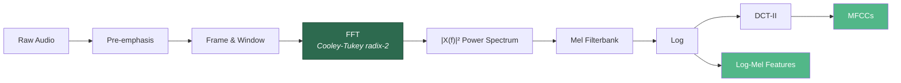
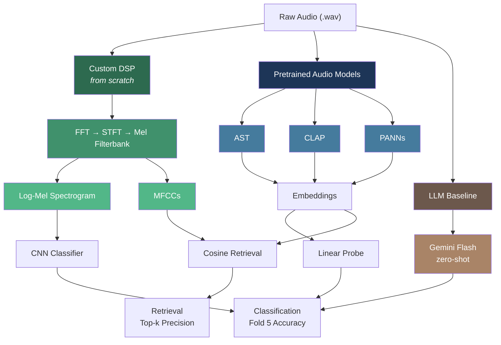

# ESC-50 Sound Classification & Retrieval

Implementing core audio DSP from scratch — FFT, STFT, mel filterbanks, MFCCs — then benchmarking these hand-built features against pretrained audio models (AST, CLAP, PANNs) and LLM baselines (Gemini) on the [ESC-50](https://github.com/karolpiczak/ESC-50) environmental sound dataset (50 classes, 2000 clips).

[](https://github.com/Audiofool934/dsp-final/actions/workflows/ci.yml)

## Results

### Classification — Fold 5 Test Accuracy

| Method | Model | Accuracy |
|--------|-------|----------|
| Transfer learning | CLAP → linear probe | **97.25%** |
| Transfer learning | AST → linear probe | 95.00% |
| Zero-shot | CLAP (text prompts) | 91.50% |
| Transfer learning | PANNs → linear probe | 90.50% |
| Zero-shot | Gemini Flash (audio input) | 78.00% |
| Trained from scratch | ResNet on **custom log-mel** | 75.00% |

### Retrieval — Fold 5 Queries vs Folds 1–4 Database

| Embedding source | Top-10 Precision | Top-20 Precision |
|------------------|-----------------|-----------------|
| CLAP | 99.50% | **100.00%** |
| AST | 98.75% | 99.25% |
| PANNs | 97.75% | 98.00% |
| CNN (ours) | 85.50% | 88.50% |
| **Custom MFCC** | 67.75% | 79.50% |

> The custom MFCC pipeline — built entirely without `numpy.fft` or `librosa` — achieves 79.5% Top-20 retrieval precision using only cosine similarity on mean/std-pooled cepstral coefficients.

## From-Scratch DSP Pipeline

The core of this project is a complete audio feature extraction pipeline with **no dependency on FFT/spectral libraries**:



| Component | Implementation | Validated against |
|-----------|---------------|-------------------|
| FFT | Radix-2 Cooley-Tukey with bit-reversal permutation | `numpy.fft.fft` — error < 1e-10 |
| STFT | Windowed frames via `np.lib.stride_tricks` (zero-copy) | `librosa.stft` |
| Mel filterbank | Triangular filters on mel-spaced frequency bins | `librosa.filters.mel` |
| DCT-II | Direct cosine basis matrix, no scipy | `scipy.fft.dct` |

### DSP Output Visualizations

All generated by the custom pipeline (`src/dsp/`), no librosa involved:

<p align="center">
  
</p>
<p align="center">
  
</p>
<p align="center">
  
</p>

## Architecture Overview



## Quick Start

```bash
pip install -e ".[dev]"
# Download ESC-50 → data/ESC-50-master/

make test                  # run test suite
make lint                  # ruff check + format

# Train CNN on custom log-mel features
PYTHONPATH=. python scripts/models/train_cnn.py --epochs 30

# MFCC retrieval sweep
PYTHONPATH=. python scripts/tasks/run_retrieval.py \
  --frame-lengths 512 1024 2048 --hop-lengths 256 512 1024

# Transfer learning (ast / clap / panns)
PYTHONPATH=. python scripts/models/eval_transfer.py --model-type clap

# Run everything end-to-end
PYTHONPATH=. python scripts/tools/run_all_experiments.py --precompute-workers 1
```

## Project Structure

```
src/
  dsp/          FFT, STFT, MFCC — from scratch, no numpy.fft
  models/       Pretrained model wrappers (AST, CLAP, PANNs) + custom ResNet
  retrieval/    Cosine-similarity retrieval (MFCC and ML embeddings)
  features/     Content-addressed feature cache (compute once, load from disk)
  tasks/        Training loops, evaluation, LLM baseline parsing
  datasets/     ESC-50 metadata loading and fold splits

scripts/
  models/       Train/eval individual models
  tasks/        Run experiment sweeps and grid searches
  tools/        Plotting, precompute, end-to-end orchestration

tests/          DSP correctness vs NumPy, label parsing, retrieval metrics
configs/        Experiment hyperparameters (YAML)
```
